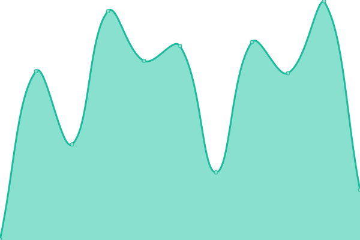
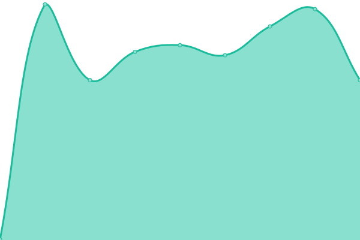
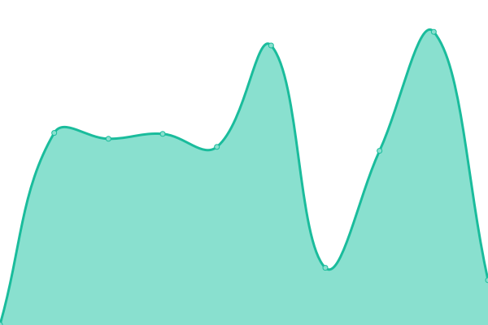

# [📈 Live Status](https://Jamalam360.github.io/uptime): <!--live status--> **🟥 Complete outage**

This repository contains the open-source uptime monitor and status page for [Jamalam](https://jamalam.tech), powered by [Upptime](https://github.com/upptime/upptime).

With [Upptime](https://upptime.js.org), you can get your own unlimited and free uptime monitor and status page, powered entirely by a GitHub repository. We use [Issues](https://github.com/Jamalam360/uptime/issues) as incident reports, [Actions](https://github.com/Jamalam360/uptime/actions) as uptime monitors, and [Pages](https://Jamalam360.github.io/uptime) for the status page.

<!--start: status pages-->
<!-- This summary is generated by Upptime (https://github.com/upptime/upptime) -->
<!-- Do not edit this manually, your changes will be overwritten -->
<!-- prettier-ignore -->
| URL | Status | History | Response Time | Uptime |
| --- | ------ | ------- | ------------- | ------ |
|  [Main Site](https://jamalam.tech/) | 🟥 Down | [main-site.yml](https://github.com/Jamalam360/uptime/commits/HEAD/history/main-site.yml) | 

 417ms
     
 | 

<a href="https://Jamalam360.github.io/uptime/history/main-site">99.99%</a>
    

|  [Maven](https://maven.jamalam.tech/) | 🟥 Down | [maven.yml](https://github.com/Jamalam360/uptime/commits/HEAD/history/maven.yml) | 

 420ms
     
 | 

<a href="https://Jamalam360.github.io/uptime/history/maven">99.99%</a>
    

|  [Pinguino Site](https://pinguino.jamalam.tech/) | 🟥 Down | [pinguino-site.yml](https://github.com/Jamalam360/uptime/commits/HEAD/history/pinguino-site.yml) | 

 442ms
     
 | 

<a href="https://Jamalam360.github.io/uptime/history/pinguino-site">100.00%</a>
    

<!--end: status pages-->

[**Visit our status website →**](https://Jamalam360.github.io/uptime)

## 📄 License

- Powered by: [Upptime](https://github.com/upptime/upptime)
- Code: [MIT](./LICENSE) © [Jamalam](https://jamalam.tech)
- Data in the `./history` directory: [Open Database License](https://opendatacommons.org/licenses/odbl/1-0/)
